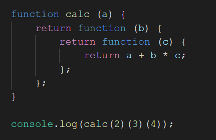

### Given the following code, what would be the output?

(if you cannot view the above image in your VSCode editor, please see it
on github.com)

1. 9
2. undefined
3. 24
4. 20
5. None of the above

Please explain your choice.

### Answer:

