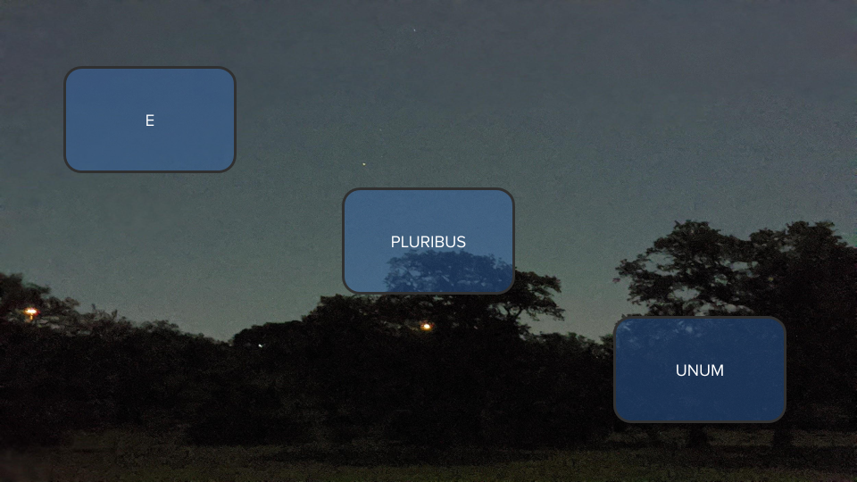
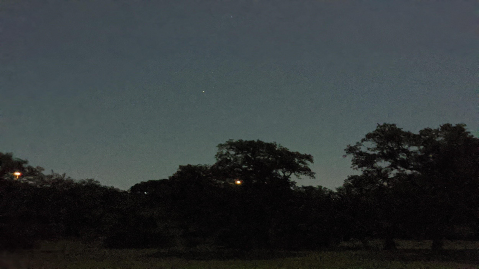

## Mid-term Exam Practical Project

# You are required to complete **ONLY ONE** of the following 3 projects:

Note: the images are embedded and may be seen by using the VSCode Preview Markdown, or simply by visiting the Github version of this page.

## Project 1:

This project is comprised of the following requirements:

1. As a website visitor, I should be able to convert from miles to kilometers, pounds to kilograms, and vice versa.  

1. The site should show me the converted values in real time. That is, as I type into miles input, the kilometers input should show the converted values. Same should happen as I type into the kilometers input box.

### Sample UI

You may develop the UI to look something like this, using Bootstrap, vanilla CSS or any other tool of your choice. You may style it as per your preference. Credit given for functional, well documented code. The values shown below are test values only.

### Hints: 

Psuedo-code is provided below to help you complete this project. Remember to take this as far as you can.

1. Create a form with two input boxes of numeric type and no submit buttons. Provide labels so user can identify the correct input box.

1. Get JavaScript or jQuery reference handles to the two input boxes. Name them `kmInput` and `milesInput` so you know which is which.

1. Attach a onSubmit or onchange event handler to each of those boxes. The handler should read the value in the box, convert to miles or km as appropriate and update the value in the other box. Ensure that you only provide upto 2 decimal places, in the converted value as shown in the image provided.

1. Provide any user instruction, so the users know how to use your converter. For example, tell the user to press "Return" if you have created a onsubmit handler.

# OR

## Project 2: STYLING

Create a web page with appropriate styling such that the view looks, visually as close as possible, like the following.  The background image has been provided in the images folder.

### Desired output

### Background Image

