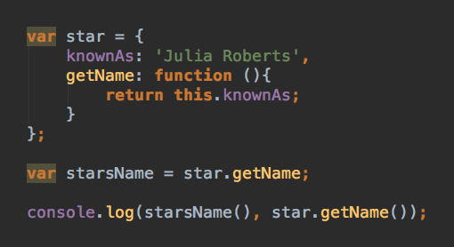

### Looking at the code below, what is the console log you would get (25%) and why (75%):

(Please view the rendered image below on github.com, not in vscode)

1. undefined undefined
1. undefined 'Julia Roberts'
1. 'Julia Roberts' 'Julia Roberts'
1. 'Julia Roberts' undefined