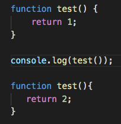

### Looking at the code below, what is the alert message you would get (25%) and why (75%), if you ran this code on a browser:

(Please view the rendered image below on github.com, not in vscode)

1. 1
1. 2
1. (nothing would happen)
1. foo    