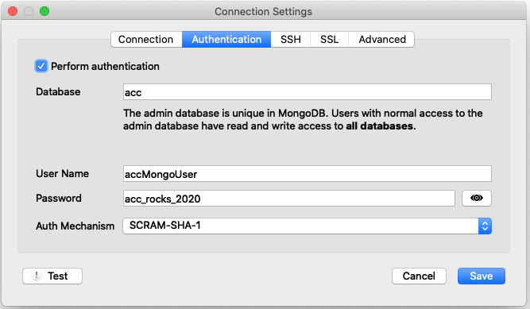

### Which query below finds restaurants whose borough field is equal to "Queens" in MongoDB? 

1. db.restaurants.find({ "borough" = "Queens" })
1. db.restaurants.find({ "borough" : { $eq : "Queens" }})
1. db.restaurants.find({ "borough" == "Queens" })
1. db.restaurants.find({ "borough" : "Queens" })

There may be multiple right answers. Indicating all of the right answers and none of the wrong answers is requested for full credit.

### MONGODB CONNECTION:

If you'd like to test your answer, connect to a mongo db instance as follows:

For testing these questions you may use your local mongo instance (remember to run it with the command `mongod`),
or use the class server. 

To access the class server, you may run the command

<pre>
    mongo --host pgdb.accsoftwarebootcamp.com
        --port 27017 
        --authenticationDatabase "acc"
        -u accMongoUser 
        -p acc_rocks_2020 

    use INSERT_YOUR_FIRST_NAME_AS_DB_NAME_HERE
</pre>

Or access the database using your Robo3T client using the following settings (all other settings are default):

