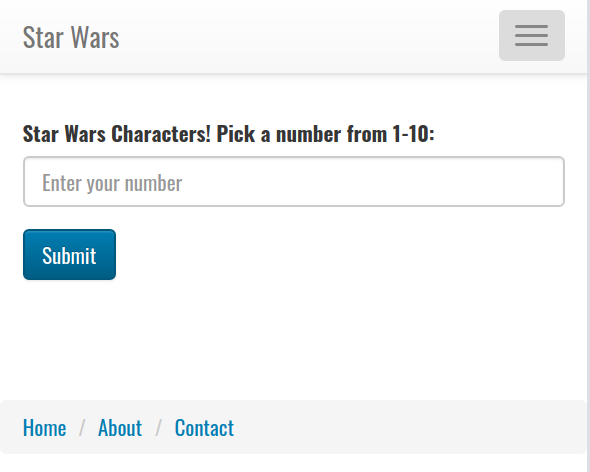
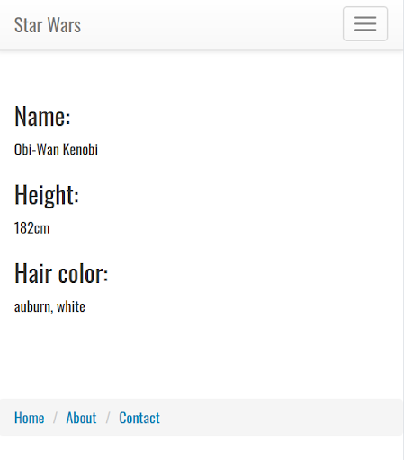

# Practical Project

This project is designed to test your knowledge of the front end as well as the back end. You will be completing an application that allows users to find information about Star Wars characters. 

The home page should look like this: 

When they click on Submit, they are taken to a page that should display the name, height, and hair color of that character.

You will be using the The Starwars Database API.  https://swapi.dev/
Read over the documentation and familiarize yourself with how to use it. You may code on your own getting of the Star Wars data, or use one of the wrapper modules if you choose:

`swapi-node`

or

`SWAPI-Wrapper`

The front-end code is provided to you as EJS files.  You need to complete the backend file that renders the data received from the SW API using the EJS files provided.  

Complete any additional configuration or install any necessary libraries to get this working.

Fix any bugs that may have been introduced so your code is working.