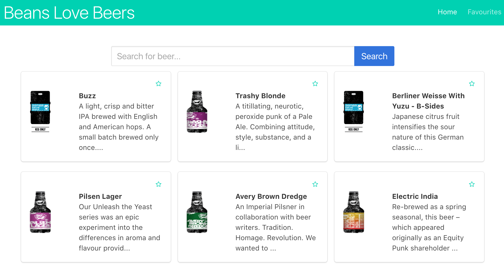

# Final Exam Project

In this section you have 2 choices.  **Do one of these, not both.**  

# Choice A: Punk Beer Front End App

### Objective: 

Use the punk beer api to create a unique project that uses templating to show data on the page. If you wish, use a front end framework like React.

Here you may see my styling, but you don't have to fully mimic this ..

The punk api (https://punkapi.com/documentation/v2) doesn’t require a key to use and provides a lot of information in its responses.

Nice feature: Create code which allows you to have a ‘favourite’ functionality. You should then be able to see a separate list of the items you favorited. This will of course not be saved to any database but may be stored within the browser (store in the DOM or store in state). This will teach you to manage application state.

Steps you may follow:

1. Template data on the page from a generic API request to the Punk Beer API (https://punkapi.com/documentation/v2)

2. Add a search bar, which makes a separate request to the api on submit.

3. Add favorite functionality which allows you to favorite a card (a div bearing data about one beer) when user clicks on a favorite checkbox or button or span (remember the todo app?).

4. create a separate URL route (using anchor tags or React router) which allows you to see all the beers you’ve favourited in the session.

Solving these problems one step at a time will help you feel less overwhelmed and more like you’re heading in a specific direction. Lastly, don't spend too much time on styling. Make it a MVP!

Do not worry if you don't have it all done. Take it as far as you can. You got the chops!!
